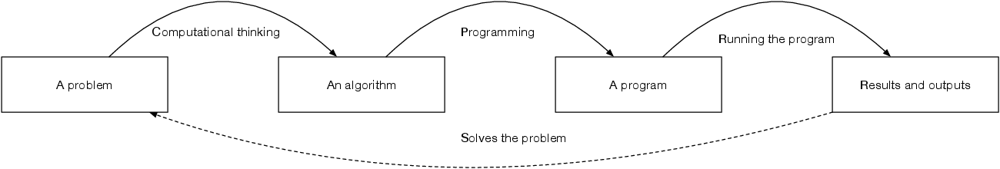
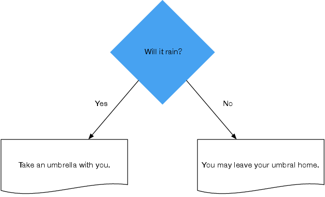

<style>
footer {
  font-size: small;
}
</style>


# Chapter 2
# Computational Thinking, Algorithms, and Writing Code

---

# Learning goals

- Understand the role of computational thinking and algorithms in solving social science problems through computation
- Develop computational thinking skills connected with variables, repetition, and conditions
- Know how to use variables, repetition, and conditions
- Know how to read data from files using
- Know how to use logical expressions to control the flow of programming
- Recognise programming patterns that can be used in programming

---

# What is programming?



Programming is all about transforming the problem into an algorithm and then turning the algorithm into a computer-understandable formulation.

---

# What is programming?


1. Computational thinking: Reformulating the problem as an algorithm (the _cognitive_ component of programming)
1. Programming: Reformulating the algorithm into an executable program (the _technical_ component of programming)

---

# What is programming?


3. Running the program executes the algorithm and produces results
1. Results solve the initial problem

---

## Programming: An Example

**A problem**: Calculate a person’s age using a computer program.

**An algorithm**:
1. Print out the person’s name
1. Calculate the person’s age.
Person's age is their dead year subtract by their birth year
1. Print out the calculated age

---

# Programming: An Example

**A Problem**: How old was Caligula, the third emperor of ancient Rome?
Caligula was born in 12 AD and died in 41 AD.

**An algorithm**: 

1. Print out ‘Caligula’
1. Calculate what is 41−12
1. Print the outcome of the calculation

---

# Programming: An Example

Code is just a text written in a specified syntax.


---

# Programming: An Example

Code is just a text written in a specified syntax.

```Python
print("Caligula")
print(41-12)
```

---

### Learning activity

* Discuss the code editor you are using
* Demonstrate Code Example with chosen IDE
* Ask students to print their own name and age (Exercise 2.10)

---

# Programming: Variables

A variable is a box that has both a label (**its name**) and some content that gets stored (**the value**).

**Problem**: Emperor Caligula reigned from 37 to 41 AD. What proportion of his life was this?

---

# Programming: Variables

**An algorithm**:

1. compute the difference between 41 and 12 (how long he lived)
1. compute the difference between 41 and 37 (the years he was in power)
1. divide the number of years of his reign by how many years he lived

We need to **store** results 1 and 2 to memory so we can later access them.

---

## Programming: Variables

We created variables with names :one: and :two: to allow us storing them into memory.

:one: = 41-12
:two: = 41-37

Proportion of life as emperor: :two: &divide; :one:

---

## Programming: Variables


---

# Variable types

* Variables have types: they can be text, numbers etc.
* We cannot mix apples and oranges
* What is `“five"+5`?

---

### Learning activity

* Do exercises 2.8 and 2.9

---

# Doing the same thing again and again

`for` loop may be used to repeat commands.


---

# Reading files

* Files are read line-by-line, _repating_ the same commands for each line.
* An iterator is a variable that changes its value after each loop.


---

### Learning activity

* Do Exercise 2.14
* Homework assignments: 2.15-2.16

---

# Controlling the execution order



* We want to branch the code based on a **condition**
* If the condition is `true`we do something, if it is `false`we do something else (or do nothing)
* This is known as `if`-structure

---

## Programming: If

**Problem**: Study only emperors who reigned for more than 10 years?

**An algorithm**:

1. calculate the length of the emperor’s reign
1. check whether the reign length is greater than 10 years
   * if it is, then print the details of that emperor (condition is true)
   * if it is not, then do nothing (condition is false)

---

## Programming: If


---

## Design patterns and variables' roles

* The most-wanted holder
* The gatherer
* The flag
* The follower

---

### Learning activity

* In-class: Do Exercise 2.18
* In-class: What purposes do each of the four design patterns serve?
* Homework: Do Exercise 2.19, 2.20, 2.24

---

# Review questions

1. Why are variables important in programming?
1. What purposes does a for loop serve?
1. What purposes does an if structure serve?
1. What types of logical expressions are there?
1. Can you sketch out a visual program for the most-wanted holder, gatherer, flag, and follower patterns?