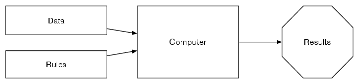
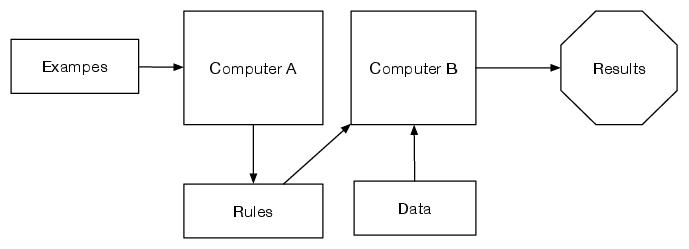
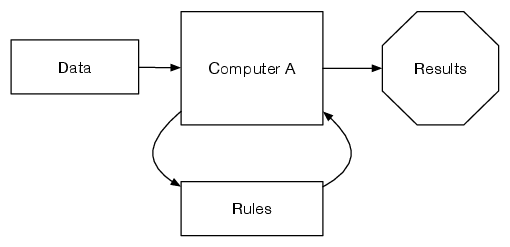

# Chapter 3
# Data science

---

# Learning goals

- Be able to describe and implement algorithms to transform data from surveys or text documents
- Describe the elements that distinguish rule-based, supervised, and unsupervised analysis approaches
- Understand suitable areas of application for each of them
- Describe at a conceptual level how each of them
- Know which algorithmic tools are used in each of them
- Understand the practices of conducting data science

---

# Purposes of data science

* Helps to classify or predict values based on data
* Works both on quantitative and qualitative data
* Suggests new methods and practices for data analysis
* Data science is not a revolution, but an extension

---

# Data science and (social) theory

* Data modelling culture: finite hand-chosen and theory-drive predictive variables are put into the model, and they are used as building blocks for the statistical model.
* Algorithmic modelling culture: the predictive variables are not a priority, but focus is shifted to produce the highest accuracy model using more variables than most in data modelling culture would like to

* Is algorithmic modelling culture atheorethic? Data are always contextual, thus social science imagination is required.

---

# What kind of data you have?

* Collected strictly for research purposes
* Emerging as a by-product of other activities

---

# What kind of data you have?

* a representative body of survey data collected for research purposes
* data from national statistics offices or similar resources
* transcripts of interviews conducted for research purposes
* digitalised discussions - for example, from parliamentary hearings
* status updates from Twitter
* videos uploaded to TikTok

---

# Preparing data

Data science works with numbers.
Therefore, data need to be transformed into a suitable numerical representation, or **features**.

* Surveys and quantitative data
  * Cleaning data (missing values etc.)
  * What kind of scales are used and does it impact modelling choices?

---

# Preparing data

Data science works with numbers.
Therefore, data need to be transformed into a suitable numerical representation, or **features**.

* Text as data requires a lot of _preprocessing_
  * Cleaning unnecessarily words and markings
  * Reducing the complexity of language
  * Often produced as document-term matrices or word embeddings

---

# Preparing data

Data science works with numbers.
Therefore, data need to be transformed into a suitable numerical representation, or **features**.

* Multimedia content requires even more _preprocessing_
  * Extracting features: colours, brightness
  * Image recognition systems may extract objects

---

In-class activities

Choose some of the following

* Group activity: Exercise 3.8a
* Individual or group activity: Exercise 3.1
* Pair- or group activity: Exercise 3.2

---

## Data science approaches

---

# Ruled-based approaches

* Researchers manually devise the rules for the data analysis.
* This usually is manual labour with quite an extensive number of `if` and `else`-rules.
* Good: Researchers know exactly what is the criteria used
* Bad: The criteria is limited by researchers imagination

---

In-class activities

Choose some of these

* Pair discussion: Exercise 3.3
* Transform Code example 3.1 into a flowchart (see Figure 2.2)
* Pair-discussion: Do you agree with Code example 3.1? Would you have done it differently?
* Programming exercise 3.16

---

# Learning rules from examples, or supervised learning

* Reproduces an existing classification
* Requires examples from the data
* Requires ground-truth values, or correct classifications for some part of the dataset
* Similar to regression analysis
* Good: Researchers control the classification in use
* Bad: Researchers cannot easily control the impact of variables

---

# Supervised learning: algorithms and practices

* Various algorithms exist: decision trees, random forests, support vector machines, neural networks, ...
* Different algorithms may have different expectations on the data, and may not suite in all cases
* Often researchers try various algorithms and examine what produces the best model performance
* Overfitting is a problem: try train/test split or k-fold cross-validation 

---

In-class activities

* Individually: Exercise 3.9

---

# Allowing rules to emerge from the data, or unsupervised learning

* Grouping data units based on statistical analysis on similarity and differences
* Does not require human guidance
* Researchers must articulate the meaning for the outcomes
* Similar to exploratory factor analysis or grounded-theory process
* Good: Allows data-driven analysis
* Bad: The interpretation is not always easy

---

# Unsupervised learning: algorithms and practices

* Various algorithms exist: principal component analysis, self-organising maps, k-means, topic models...
* Algorithms always spit out a solution to the problem: validation of outcomes is critical

---

In-class activities 

* Individually or in pairs: Exercise 3.5

---

Activities for ruled-based, supervised and unsupervised data analysis

* Group activity: Exercise 3.8b-c
* Homework: Exercise 3.6 or 3.7
* Programming: See suitable programming exercises from chapter.

---

# Review questions

1. What purposes does data science serve in social science research?
1. How can non-quantitative data (such as text or images) be transformed into computational data, and what issues does this entail?
1. List the similarities that connect rule-based data analysis, supervised, and unsupervised machine-learning algorithms.
1. List the elements that distinguish them algorithms.
1. What kinds of research and data management practices do supervised and unsupervised machine-learning methods involve?