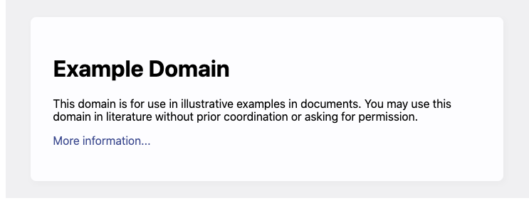

<style>
footer {
  font-size: small;
}
</style>


# Chapter 9
# Computation and Data: Collection, storage and manipulation in R

---

# Learning goals

* Connect to the Internet via libraries and extract meaningful content from it for your work.
* Use libraries to collect data from hypertext documents.
* Read application programming interface (API) documentation.
* Collect data from online APIs that do not require authentication.
* Read and store data in .json format.
* Compare the .csv and .json forms of data storage.

---

# Data

* Increasingly we repurpose data for our research practices.
* We discuss now how computers can help in collection, storage and manipulation of the data.
* Remember: No quantity of data can rectify a dull or, _worse_, irrelevant research question.

---

# Collecting data from the Internet

Connecting to web resources with the help of `httr` library.

```R
library(httr)

## collect the Web site example.com
response <- GET('http://www.example.com')
website_content = content( response, 'text' )

print( website_content )
```

---

# Collecting data from Web pages

```HTML
<!doctype html>
<html>
<head>
  <title>Example Domain</title>
  <meta charset=”utf-8” />
</head>
<body>
  <div>
    <h1>Example Domain</h1>
    <p>This domain is for use in illustrative examples in documents. You may use this domain in literature
    without prior coordination or asking for permission.</p>
    <p><a href=”https://www.iana.org/domains/example”>More information...</a></p>
  </div>
</body>
</html>
```

---

# Collecting data from Web pages



---

# Collecting data from Web pages

* <h1> indicates first-level page header
* <p> separates paragraphs
* <a> indicates a link

---

# Collecting data from Web pages

Knowing the semantic meaning of HTML tags, websites can be further analysed using other libraries.

For R, use `rvest` and in some more difficult cases `selenium`.

---

# Collecting data from Web services

Web services define APIs: in essence these are grammars
* determining and identifying what data can be collected from the service
* how data are to be requested properly
* the format in which the data get returned to the requester

---

# Collecting data from Web services

Requests:
`https://data.police.uk/api/crimesstreet/
all-crime?lat=51.5073&lng=-0.171505`

Response (partial):
```JSON
{"category":"anti-social-behaviour",
"location_type":"Force",
"location":{"latitude":"51.517535","street":{"id":1670905,"name":"On or near A4206"},"
"longitude":"-0.182180"},
"context":"",
"outcome_status":null,
"persistent_id":"","id":104301433,"location_subtype":"","month":"2022-08"}
```

---

# Storing and manipulating data

* Comma-separated values (CSV) compared to dictionary-style data format JSON.
  * CSV requires all rows must have the same number of columns
  * JSON allows more complex structures, like lists to be used

---

# JSON

```JSON
[
  {
    "id": 1,
    "text": "This post has no Likes",
    "likes": []
  }, {
    "id": 2,
    "text": "This post has two Likes",
    "likes": [
      "John Smith",
      "Jane Smith"
    ]
  }
]
```

---

# JSON

```R
library(jsonlite)
data <- read_json( 'data.json' )

for( row in 1:length(data) ){
  print( paste( data[[ row ]]$id, data[[ row ]]$text ) )
  likes <- data[[ row ]]$likes
  for( user in likes ) {
    print( paste(' Liked by', user ) )
  }
}
```

---

# Data management practices

1. Always archive the original ‘raw’ data before any cleaning or processing.
1. Document each processing and wrangling step.
1. In the end, rerun the processing steps to ensure you have not forgotten anything.

---

# Review questions

1. What kinds of steps are carried out in a Web-scraping process?
1. Why are APIs preferable to Web scraping for collection of data?
1. How can scholars access and use data not found online?
1. Why might the .json data format preferred over .csv files and binary dumps?
1. What should you remember when working with data?